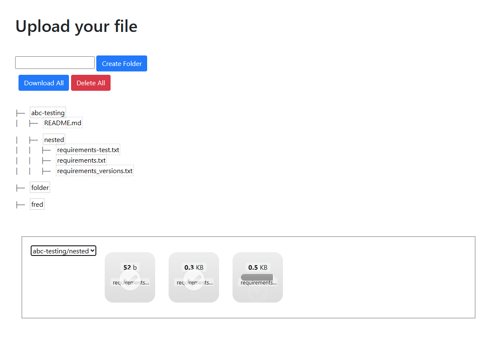
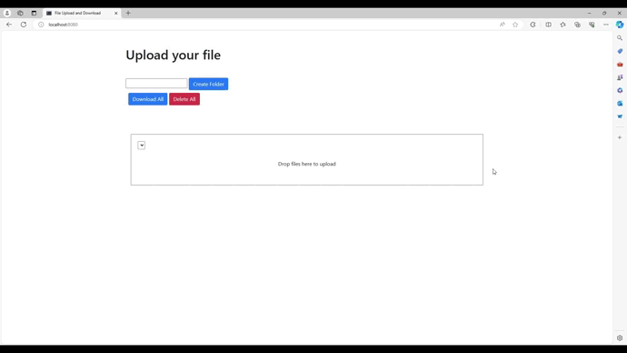

# Swift Share

Swift Share is an easy-to-use local file sharing application that simplifies and speeds up project sharing for people working on multiple projects and devices by up to 100% over GitHub.

## Key Features
* 100% private and secure.
* Drag and drop codebases (projects) into a target folder or nested folder at any level of the directory tree with a single click.
* Download or delete files with a single click.
* Download or delete folders and nested folders with a single click.
* Create folders and nested folders by simply typing a name and pressing Enter.
* Display a clear tree view of all files and folders in the codebase.

## Example

## Demo

## Setup
On Windows, go to Control Panel > System and Security > Windows Defender Firewall > Allow an app or feature through Windows Defender Firewall. Click on Change settings. Tick the Python checkbox. If your network is public, tick the Public checkbox. If it's private, tick the Private checkbox. Apply the changes by clicking OK.

Run `pip install -r requirements.txt` in a terminal. Then run `python share.py` to start the server. Now you can access Swift Share from any device on your local network using the second URL printed to the console.

*Note: Completing the setup does not make this application or your computer accessible from other networks or the Internet. By default, a router blocks all incoming connections from other networks and the Internet.*

## Frameworks
* Flask
    - Define routes and handle HTTP requests and responses.
* Flask-Dropzone
    - Add drag-and-drop file upload functionality.
* Bootstrap-Flask
    - Create a responsive web UI with pre-defined Bootstrap CSS classes.
* jQuery
    - Select and manipulate HTML elements during events.

## Limitations
* No tracking history for multiple people working on the same files.